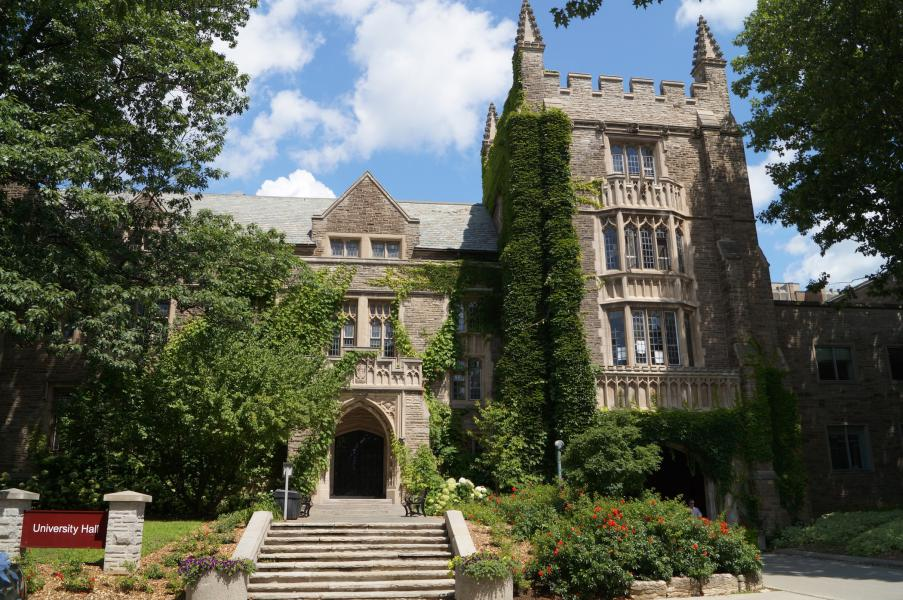
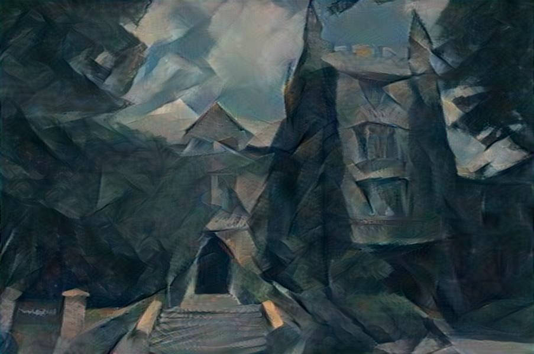
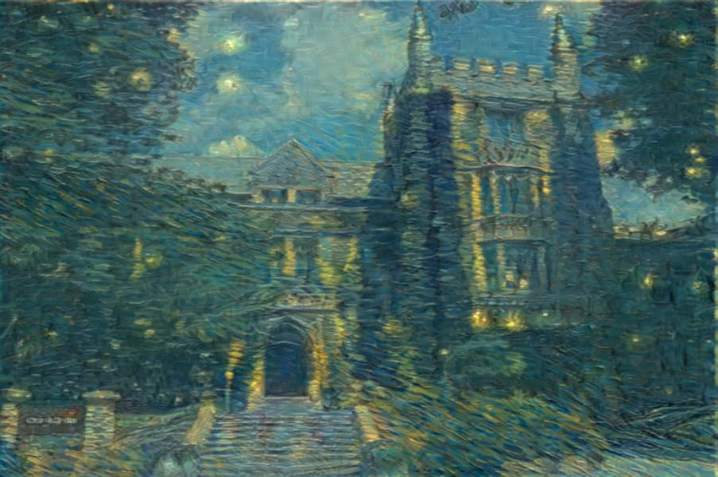
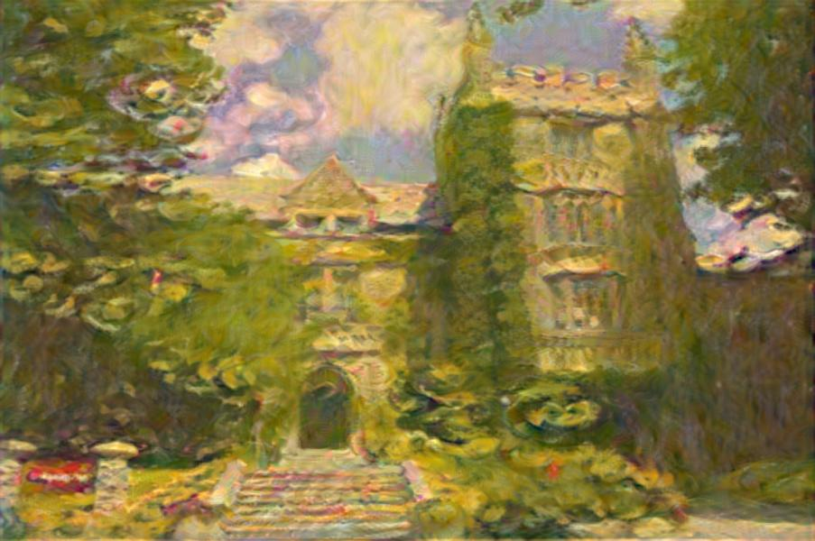
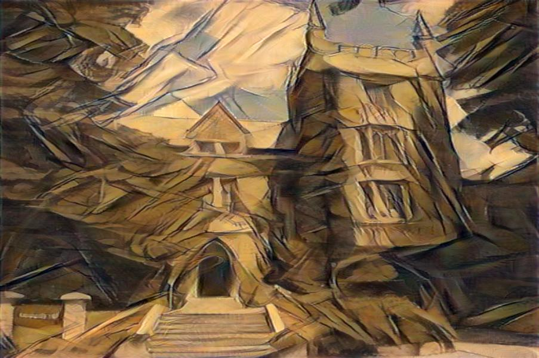
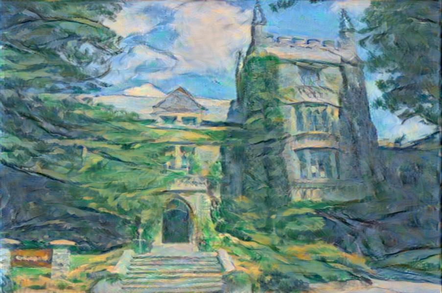

# neural-style

This is a PyTorch implementation of [Neural Networks of Artistic Style](https://arxiv.org/abs/1508.06576)

## Dependencies

### Python packages
* [pyorch](http://pytorch.org/)
* [numpy](http://www.numpy.org/)
* [matplotlib](https://matplotlib.org/)
* [pil](https://pypi.python.org/pypi/PIL)
* [tqdm](https://pypi.python.org/pypi/tqdm)

## Results

 
 
 
## Acknowledgments
